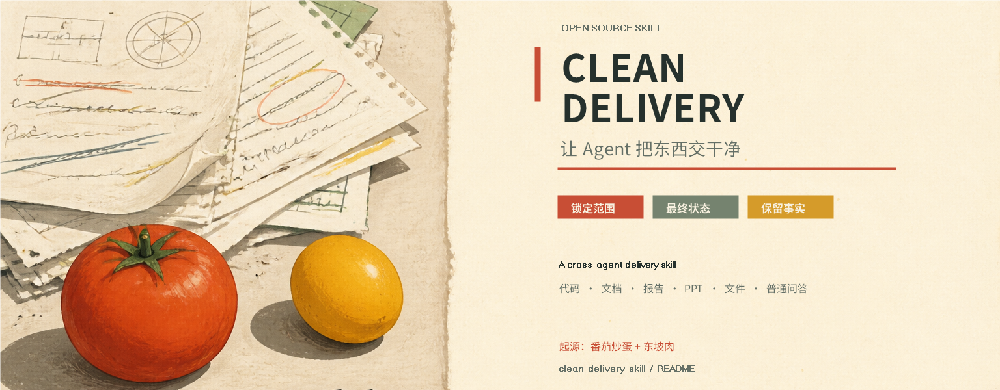
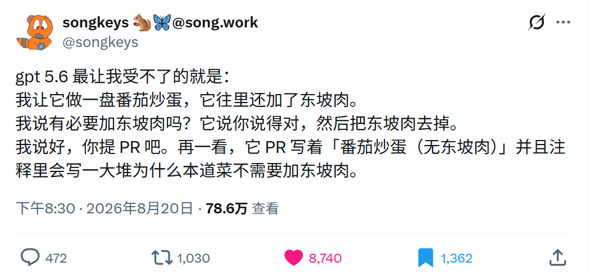
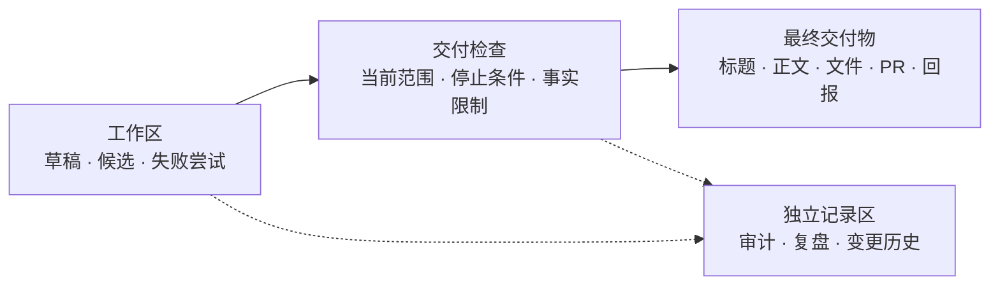

# Clean Delivery

让 Agent 把东西交干净。

这是一套给 coding agent、通用 agent、办公 agent 和文件生成工具用的规则：交付物呈现当前成果，标题、文件名、正文、注释、PR 和交付回报保持清楚，工作台上的草稿与删改痕迹留在工作记录里。

## 60 秒开始

```powershell
git clone https://github.com/CheaperjamRen/clean-delivery-skill.git
Set-Location clean-delivery-skill
Copy-Item templates\AGENTS.md ..\your-project\AGENTS.md
```

想让某个宿主按 Skill 目录加载时，使用下面的项目级副本命令：

```powershell
New-Item -ItemType Directory -Force ..\your-project\.agents\skills\clean-delivery | Out-Null
$skillPath = '..\your-project\.agents\skills\clean-delivery\SKILL.md'
if (Test-Path $skillPath) {
    Write-Host "SKILL.md already exists. Compare it with skills\clean-delivery.md before updating."
} else {
    Copy-Item skills\clean-delivery.md $skillPath
}
```

## 起点：一盘番茄炒蛋和一块东坡肉



起源：X 账号 [`@songkeys`](https://x.com/songkeys) 于 2026-08-20 发布的“番茄炒蛋加东坡肉”吐槽。

故事很简单：让 GPT 做一盘番茄炒蛋，它顺手加了东坡肉。被问到“有必要吗”，它认同后把肉去掉。准备提 PR 时，标题出现“番茄炒蛋（无东坡肉）”，注释又花很长篇幅解释这道菜为什么没有东坡肉。

笑点在菜，麻烦在交付。代码、报告、PPT、表格和导出文件都可能出现同一种痕迹：标题写成“去除某某版”“按要求更新版”，正文写“根据用户要求”，小标题带括号，文件名记录一串删改历史。读者拿到一份成果，还要顺手阅读一遍 Agent 的工作日志。

## 问题的范围比 coding agent 更大

办公 Agent 会把报告叫作“精简摘要版”，PPT 页面写“按要求删除竞品页”，文件导出成“最终版-v3-去掉详细分析”。通用 Agent 会在回答末尾留下“原本考虑过……”和一串后续建议。Coding agent 会把额外校验、抽象、错误处理和未来计划塞进小任务。

这些内容经常有合理理由。它们进入成果后，标题失去辨识度，正文变得吵闹，Review 要在 diff 之外继续猜测，后续维护者还要判断哪些句子属于当前事实。

## 为什么会出现

### 扩展冲动

模型面对一个空白处，会倾向于补齐边界、弹性和“可能有用”的功能。Anthropic 的提示词文档把额外文件、过度抽象和超出请求的改进列为 overengineering，并给出范围控制示例。

### 留痕冲动

多轮 Agent 会把前几轮消息、工具结果和修正继续带入上下文。旧候选还在，交付时就容易变成回声。OpenAI 对 Codex agent loop 的公开说明清楚描述了这条链路。

### 自证冲动

模型学到的“好回答”常常周到、透明、解释充分。它把理由写进最终文件，读者却只需要成果和必要事实。

### 交付出口没有分层

草稿、候选、失败和审计记录有自己的用途。报告、PR、PPT 和导出文件承担阅读与使用。两个出口共用同一段话，工作记录就会污染成果。

推进过快的倾向可以称作“仓促性”。给普通用户的做法很实用：先看计划，关键动作前停一下，完成后检查目标之外的代价。这个仓库把停顿放在最终交付前，再看一遍标题、范围、残留痕迹、事实限制和链接。

更完整的分析见 [docs/cause-analysis.md](docs/cause-analysis.md)，研究链接集中在 [docs/research.md](docs/research.md)。

## 解决方案

### 1. 直接加载 Skill

把 [skills/clean-delivery.md](skills/clean-delivery.md) 放入你使用的 Agent 的 Skill 目录。支持目录式 Skill 的宿主，可以这样准备项目级副本：

```powershell
New-Item -ItemType Directory -Force .agents\skills\clean-delivery | Out-Null
Copy-Item skills\clean-delivery.md .agents\skills\clean-delivery\SKILL.md
```

各工具的 Skill 目录名称可能不同，规则正文保持一致即可。

### 2. 复制 AGENTS 模板

```powershell
if (Test-Path .\AGENTS.md) {
    Write-Host "AGENTS.md already exists. Merge templates\AGENTS.md into it manually."
} else {
    Copy-Item templates\AGENTS.md .\AGENTS.md
}
```

模板把范围、交付面、事实限制和检查项放在项目根目录，适合长期项目。

### 3. 在 prompt 末尾加三行

```text
干净交付，锁定范围，保留关键理由。
请按当前请求完成并在停止条件处收束。
交付物的标题、文件名、正文、注释和说明呈现最终状态；保留必要的事实限制、验证结果和链接，过程记录另存。
```

复制版和英文版见 [prompts/minimal.md](prompts/minimal.md)。

### 4. 记住四个词

`干净交付｜锁定范围｜只报结果｜保留关键理由`

把四个词写进 Skill 或 `AGENTS.md` 后，日常请求只需要说“干净交付，锁定范围”。关键词的跨会话效果取决于宿主是否加载了规则，详见 [docs/keywords.md](docs/keywords.md)。

## 规则长什么样



实线表示交付路径，虚线表示按需保留的审计记录。

| 位置 | 交付形状 |
| --- | --- |
| 注释 | non-obvious reason、边界或失效条件。 |
| PR / Commit | 最终行为、验证结果、风险、阻塞项和链接。 |
| 报告 / PPT / 文件 | 任务本身的标题和最终结构。 |
| 过程记录 | 草稿、候选、失败尝试和完整审计，单独存放。 |

真实限制始终保留：失败测试、数据缺口、风险、权限要求和未完成项，用事实、影响和动作表达。审计或复盘有明确需求时，单独提供记录。

## 示例

- [原因分析](docs/cause-analysis.md)
- [跨场景示例](docs/examples.md)
- [研究与公开讨论](docs/research.md)
- [关键词说明](docs/keywords.md)
- [独立 Skill](skills/clean-delivery.md)
- [AGENTS.md 模板](templates/AGENTS.md)
- [极简 Prompt](prompts/minimal.md)

## 这套规则适合什么时候

适合成果会被别人阅读、评审、复用或直接打开使用的任务：代码、PR、报告、简历、PPT、表格、设计稿、导出文件、邮件草稿和普通问答。

用户明确索要变更历史、决策记录、审计证据或方案比较时，保留这些内容；把记录放到它自己的位置，主成果继续保持清楚。

## 研究边界

“交付污染”是对可观察输出形状的工作流命名。它帮助人和 Agent 做交付检查，不能替代具体项目的验收，也不构成对某个模型版本的普遍判断。研究资料与证据边界见 [研究文档](docs/research.md)。

## 贡献

欢迎提交真实案例、跨工具适配和更短的规则。请让示例本身保持干净：标题描述成果，正文给出事实，过程记录放在独立位置。

## License

MIT
